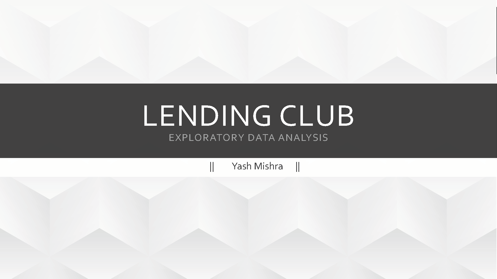
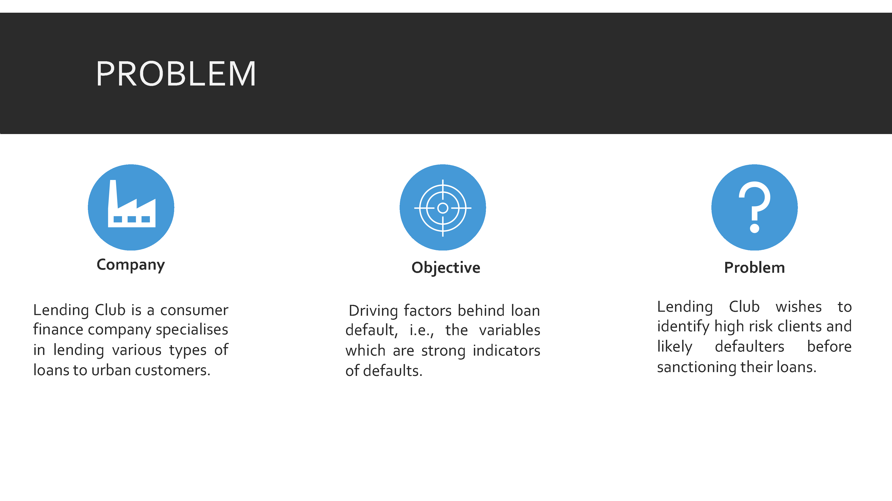
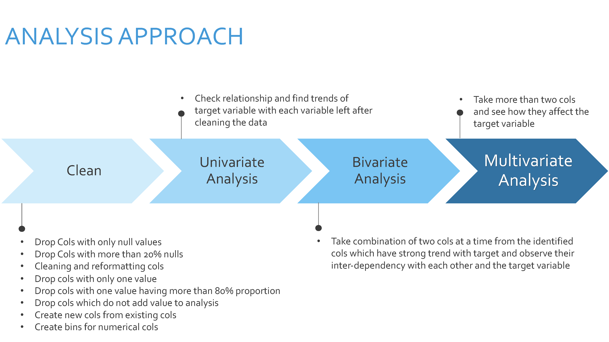
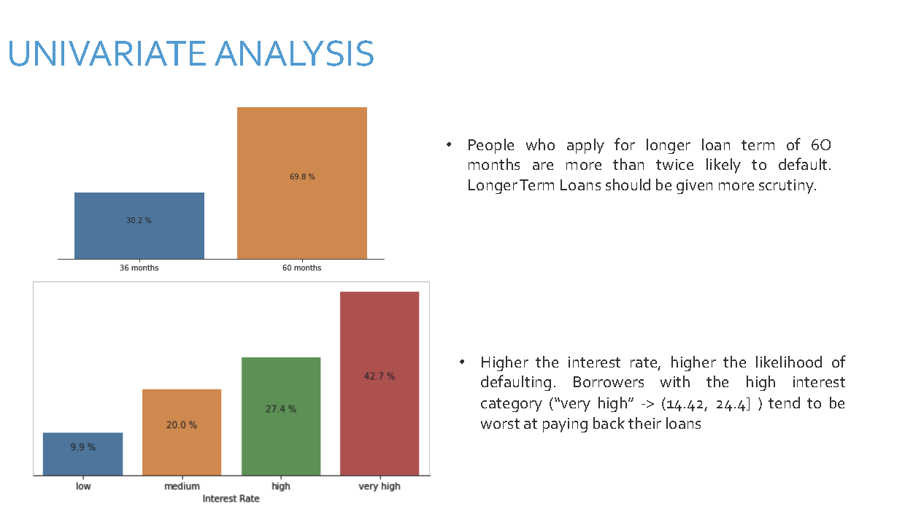
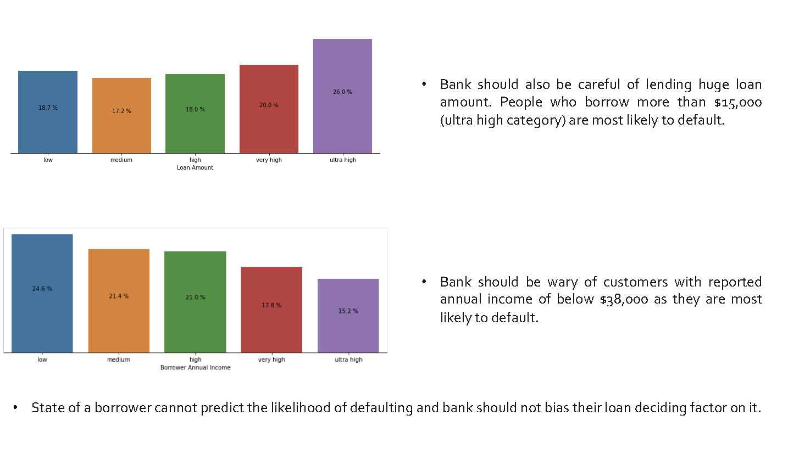
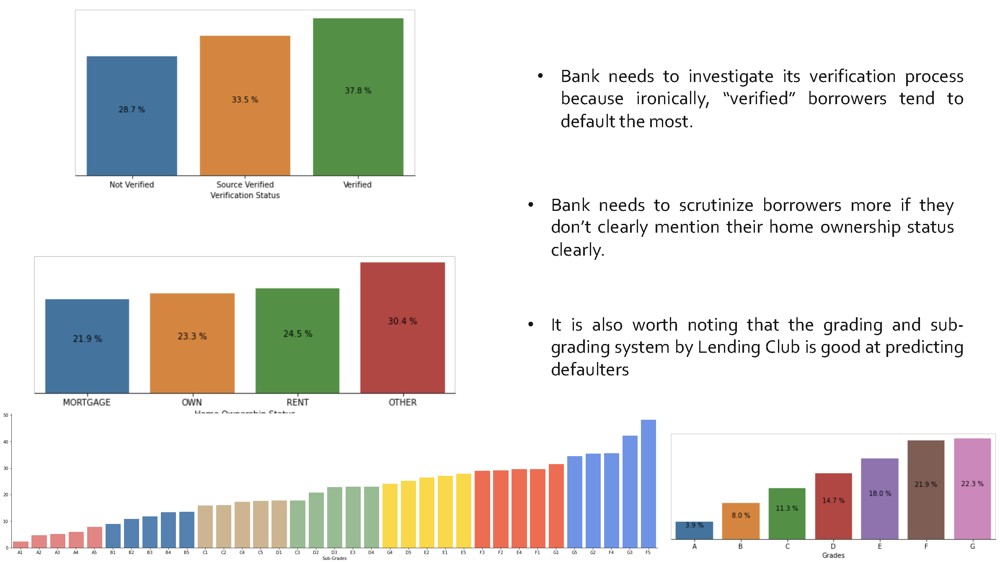
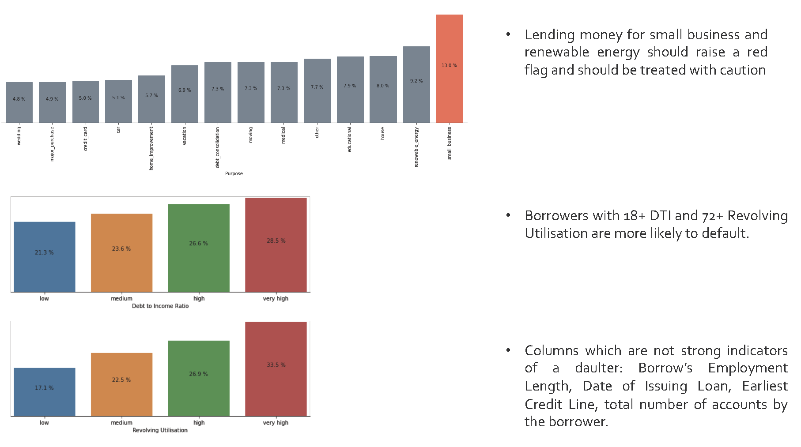
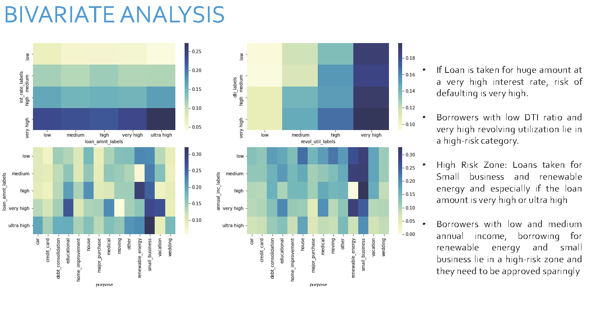
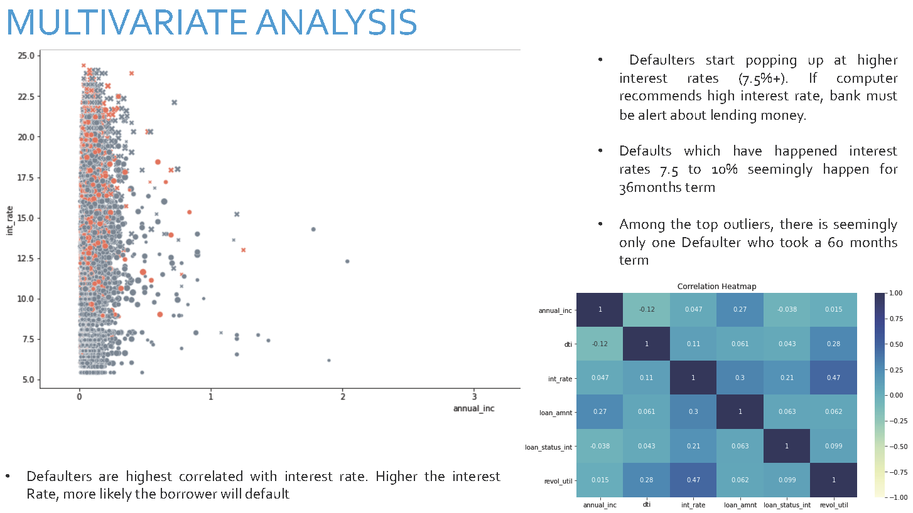

# Lending-Club-EDA
Exploratory Data Analysis of the famous Lending Club Bank data. 

# Scope of analysis

- Identify the customers who are more likely to repay the loan and give loan to only those customers.
- Identify customers who are likely to default on the loan and save the company from financial loss.
- Need to identfy the trend of such customers from the data provided loan.csv file.
- Action to be taken rejecting loan application,reducing the amount of loan or lending to risky applicants at higher interest rates.
- When a person applies for loan involves to types of descisions:
 
1. Loan accepted - If the company approves the loan, there are 3 possible scenarios described below:
 
a. Fully paid: Applicant has fully paid the loan (the principal and the interest rate).
 
b. Current: Applicant is in the process of paying the instalments, i.e. the tenure of the loan is not yet completed. These candidates are not labelled as 'defaulted'.
 
c. Charged-off: Applicant has not paid the instalments in due time for a long period of time, i.e. he/she has defaulted on the loan.
 
2. Loan rejected: The company had rejected the loan (because the candidate does not meet their requirements). Since the loan was rejected, there is no transactional history of those applicants with the company and so this data is not available with the company (and thus in this dataset).
 

# Business Objectives

- Identifying risky applicants who are likely to default on loan , such loans can be cut down and reduce the amount of credit loss for the company. Identification of such applicants using EDA is the aim of this case study.

- The company wants to understand the driving factors (or driver variables) behind loan default, i.e. the variables which are strong indicators of default.  The company can utilise this knowledge for its portfolio and risk assessment.

# Results Expected
 
1. Write all your code in one well-commented Python file; briefly mention the insights and observations from the analysis. 
 
2. Present the overall approach of the analysis in a presentation 
- Mention the problem statement and the analysis approach briefly.
- Explain the results of univariate, bivariate analysis etc. in business terms.
- Include visualisations and summarise the most important results in the presentation.

